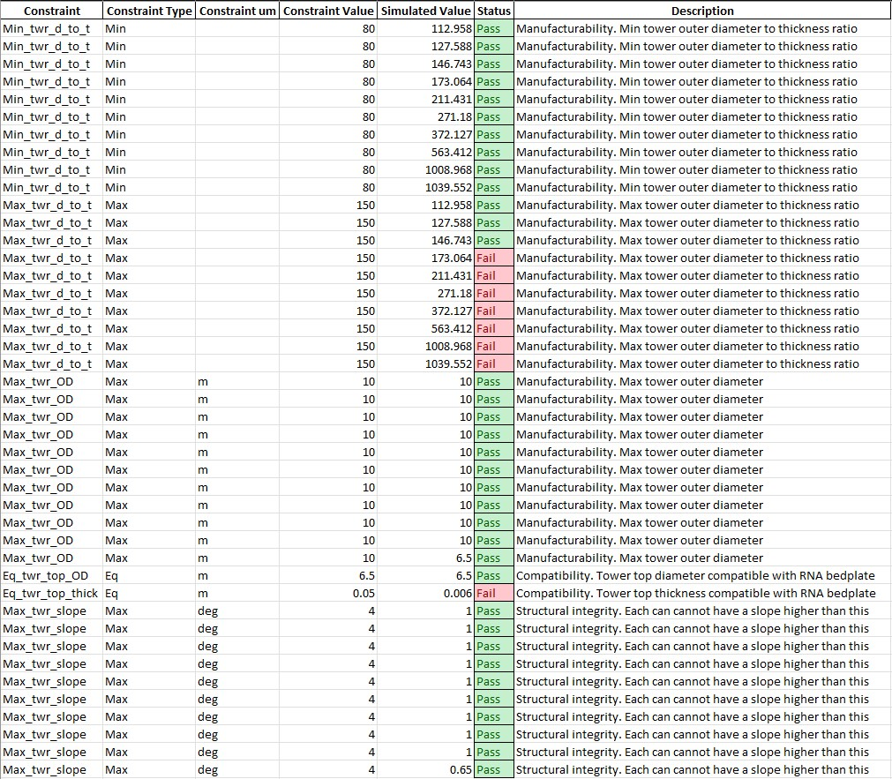

Analysis A01 L0: Tower geometrical characteristics check
========================================================

Introduction
------------
Aim
~~~
To verify that the geometrical characteristics of the tower are compatible against a series of simple geometrical checks

Constraints
~~~~~~~~~~~
To be specified in CNSTR.xlsx

+---+------------------+------+-----------------+---------------------------------------------------------------------+
| # | Constraint name  | Unit | Suggested value | Description                                                         |
+===+==================+======+=================+=====================================================================+
| 1 | Eq_twr_top_OD    | m    | 6.5^            | Compatibility. Tower top diameter compatible with RNA bedplate      |
+---+------------------+------+-----------------+---------------------------------------------------------------------+
| 2 | Eq_twr_top_thick | m    | 0.050^          | Compatibility. Tower top thickness compatible with RNA bedplate     |
+---+------------------+------+-----------------+---------------------------------------------------------------------+
| 3 | Max_twr_OD       | m    | 10^^            | Manufacturability. Max tower outer diameter                         |
+---+------------------+------+-----------------+---------------------------------------------------------------------+
| 4 | Max_twr_slope    | deg  | 4.00^^          | Structural integrity. Each can cannot have a slope higher than this |
+---+------------------+------+-----------------+---------------------------------------------------------------------+
| 5 | Min_twr_d_to_t   | N/A  | 80^^?           | Manufacturability. Min tower outer diameter to thickness ratio      |
+---+------------------+------+-----------------+---------------------------------------------------------------------+
| 6 | Max_twr_d_to_t   | N/A  | 150^^?          | Manufacturability. Max tower outer diameter to thickness ratio      |
+---+------------------+------+-----------------+---------------------------------------------------------------------+

+-------+---------------------------------------------------------------------------------------------------------------------------------------------------------------------------------+
| Notes |                                                                                                                                                                                 |
+=======+=================================================================================================================================================================================+
| ^     | For IEA 15MW Reference Wind Turbine (Updated reference values `here <https://github.com/IEAWindSystems/IEA-15-240-RWT/blob/master/Documentation/IEA-15-240-RWT_tabular.xlsx>`_) |
+-------+---------------------------------------------------------------------------------------------------------------------------------------------------------------------------------+
| ^^    | Value agreed in WIND-14 STIFF-STIFF TOWER DESIGN FOR FLOATING WIND TURBINES (Previous TIC LCPE project)                                                                         |
+-------+---------------------------------------------------------------------------------------------------------------------------------------------------------------------------------+

Methodology
~~~~~~~~~~~

Level 0 (L0)
^^^^^^^^^^^^

The values of the parameters, read from the WEIS output files, are compared against the constraint values.
No postprocessing of the WEIS output necessary.

Prepare the input file
----------------------
The SCUBE input data can be found in ``scube\data``.

Tower
~~~~~
- Open the file ``INPUT_tower.xlsx``
- Familiarise yourself with the variables, explained in the ``legend`` sheet
- Specify the geometry of the cans in the ``geometry`` sheet
- Specify the aerodynamic drag properties of the tower in the ``drag`` sheet (if unsure, leave the default values, they can be applied to a wide range of dimensions)
- Specify the tower material characteristics in the ``material`` sheet (the default values are for the steel	ASTM A572 Grade 50, see more `here	<http://www.matweb.com/search/DataSheet.aspx?MatGUID=9ced5dc901c54bd1aef19403d0385d7f>`_

Run the analysis
----------------
- Open a miniforge/miniconda/conda terminal prompt
- Activate the WEIS environment you set up (see :ref:`sec_installation`)
.. code:: bash
  conda activate weis-env
- Navigate to the root folder `scube'
- Launch the analysis with the following command
.. code:: bash
  `python main.py A01 L0'

Expected conda prompt outcome
-----------------------------
If all goes well, you should see something similar to the following.

.. code:: bash
  
  Using weis.aeroelasticse in rosco.toolbox...

   ******* SCUBE: preprocessing - updating tower geometry *******
  
   ******* SCUBE: processing - WEIS analysis *******
  RuntimeWarning: C:\Users\mauri\miniforge3\envs\weis-env2\Lib\site-packages\wisdem\commonse\utilization_dnvgl.py:322
  The number of calls to function has reached maxfev = 50.RuntimeWarning: C:\Users\mauri\miniforge3\envs\weis-env2\Lib\site-packages\wisdem\commonse\cylinder_member.py:513
  divide by zero encountered in scalar divideRuntimeWarning: C:\Users\mauri\miniforge3\envs\weis-env2\Lib\site-packages\wisdem\commonse\cylinder_member.py:514
  divide by zero encountered in scalar divide----------------
  Design Variables
  ----------------
  name  val  size  lower  upper
  ----  ---  ----  -----  -----
  
  -----------
  Constraints
  -----------
  name  val  size  lower  upper  equals
  ----  ---  ----  -----  -----  ------
  
  ----------
  Objectives
  ----------
  name  val  size
  ----  ---  ----
  
  Run time (A01_L0): 11.173307180404663
  
   ******* SCUBE: postprocessing - results VS constraints analysis *******
  UserWarning: C:\Users\mauri\miniforge3\envs\weis-env2\Lib\site-packages\openpyxl\worksheet\_read_only.py:85
  Data Validation extension is not supported and will be removed
           ******* Constraint definitions imported *******
  
           ******* Simulation output xlsx and yaml files data loaded *******
  
           ******* Constraint verification started *******
  
                   Check of constraint Min_twr_d_to_t
  
                   Check of constraint Max_twr_d_to_t
  
                   Check of constraint Max_twr_OD
  
                   Check of constraint Eq_twr_top_OD
  
                   Check of constraint Eq_twr_top_thick
  
                   Check of constraint Max_twr_slope
  
           ******* Constraint verification completed *******
  
   ******* SCUBE: Validation report with formatting exported successfully *******
  
  [INFO] Time taken: 0:00:13

Interpret the output file (validation report)
---------------------------------------------
If run successfully, the file ``validation_report_A01_L0.xlsx`` should have been created in the folder ``scube\output``.

.. note::
  NB If the file already existed, it will be overwritten.

In this spreadsheet, you should see a "Constraint Checks" sheet, in which the results of the validation are reported.
An example is given in the following figure.

.. note::
  When a constraint need to be verified for each can specified in ``INPUT_tower.xlsx``, the constraint is repeated *n* times, where *n* is the number of the cans/sections.

   Analysis validation report example

Common errors
-------------

Permission error
~~~~~~~~~~~~~~~~
.. code:: bash

  PermissionError: [Errno 13] Permission denied: 'data/INPUT_tower.xlsx'

The file ``INPUT_tower.xlsx`` is still open on your pc. In order to be safely read by SCUBE, the file needs to be closed.

A similar error can occur for ``CNSTR.xlsx``
