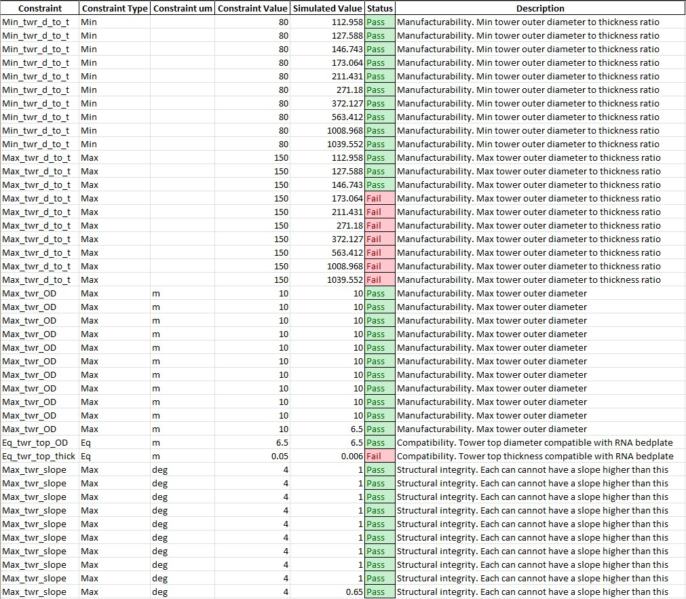

Analysis A02 Lx: max average tilt angle (serviceability limit state)
========================================================

Introduction
------------
Aim
~~~
To verify that the *average* whole platform inclination angle is less than the specified angle (serviceability limit state).

Constraints
~~~~~~~~~~~
To be specified in CNSTR.xlsx

+----+---------------+-------+-------+---------------------------------------------------------------------------------+
| ID | Constraint    | Units | Value | Description                                                                     |
+====+===============+=======+=======+=================================================================================+
| 1  | Max_tilt_mean | deg   | 5.00  | Max allowable average tilt (global platform response inclination) in roll/pitch |
+----+---------------+-------+-------+---------------------------------------------------------------------------------+

+-------+---------------------------------------------------------------------------------------------------------------------------------------------------------------------------------+
| Notes |                                                                                                                                                                                 |
+=======+=================================================================================================================================================================================+
| ^     | For IEA 15MW Reference Wind Turbine (Updated reference values `here <https://github.com/IEAWindSystems/IEA-15-240-RWT/blob/master/Documentation/IEA-15-240-RWT_tabular.xlsx>`_) |
+-------+---------------------------------------------------------------------------------------------------------------------------------------------------------------------------------+
| ^^    | Value agreed in WIND-14 STIFF-STIFF TOWER DESIGN FOR FLOATING WIND TURBINES (Previous TIC LCPE project)                                                                         |
+-------+---------------------------------------------------------------------------------------------------------------------------------------------------------------------------------+
| ^^^   | DNV-RP-0289, Section 5.5 Serviceability limit state                                                                                                                             |
+-------+---------------------------------------------------------------------------------------------------------------------------------------------------------------------------------+

Methodology
~~~~~~~~~~~

Level 0 (L0)
^^^^^^^^^^^^
The average tilt angle is obtained with an analytical approach, using the following equation.

.. math::
   \theta = \arcsin \left( \frac{F_{Trated} * (z_h - z_m)} { F_B * GM_{pitch} } \right) / \pi*180

where 

+----------------------+------+------------------------------------------------------------+
| Variable             | u.m. | Description                                                |
+======================+======+============================================================+
| :math: `F_{T_rated}` | N    | Aerodynamic thrust at rated wind speed                     |
+----------------------+------+------------------------------------------------------------+
| :math: `z_h`         | m    | Hub height vertical coordinate                             |
+----------------------+------+------------------------------------------------------------+
| :math: `z_m`         | m    | Fairlead vertical coordinate                               |
+----------------------+------+------------------------------------------------------------+
| :math: `F_B`         | N    | Buoyancy force (at rest)                                   |
+----------------------+------+------------------------------------------------------------+
| :math: `GM_{pitch}`  | m    | Metacentric height around for a rotation around the y axis |
+----------------------+------+------------------------------------------------------------+

Level 1 (L1)
^^^^^^^^^^^^
Not implemented.

Level 2 (L2)
^^^^^^^^^^^^

Perform the analysis
--------------------

Prepare the input file
~~~~~~~~~~~~~~~~~~~~~~
The SCUBE input data can be found in ``scube\data``.

Tower
^^^^^

- Open the file ``INPUT_tower.xlsx``
- Familiarise yourself with the variables, explained in the ``legend`` sheet
- Specify the geometry of the cans in the ``geometry`` sheet
- Specify the aerodynamic drag properties of the tower in the ``drag`` sheet (if unsure, leave the default values, they can be applied to a wide range of dimensions)
- Specify the tower material characteristics in the ``material`` sheet (the default values are for the steel	ASTM A572 Grade 50, see more `here	<http://www.matweb.com/search/DataSheet.aspx?MatGUID=9ced5dc901c54bd1aef19403d0385d7f>`_

Run the analysis
~~~~~~~~~~~~~~~~
- Open a miniforge/miniconda/conda terminal prompt
- Activate the WEIS environment you set up (see :ref:`sec_installation`)

.. code:: bash

  conda activate weis-env

- Navigate to the root folder ``scube``

- Launch the analysis with the following command

.. code:: bash

  python main.py A01 L0

Expected conda prompt outcome
~~~~~~~~~~~~~~~~~~~~~~~~~~~~~
If all goes well, you should see something similar to the following.

.. code:: bash
  
  Using weis.aeroelasticse in rosco.toolbox...

   ******* SCUBE: preprocessing - updating tower geometry *******
  
   ******* SCUBE: processing - WEIS analysis *******
  RuntimeWarning: C:\Users\mauri\miniforge3\envs\weis-env2\Lib\site-packages\wisdem\commonse\utilization_dnvgl.py:322
  The number of calls to function has reached maxfev = 50.RuntimeWarning: C:\Users\mauri\miniforge3\envs\weis-env2\Lib\site-packages\wisdem\commonse\cylinder_member.py:513
  divide by zero encountered in scalar divideRuntimeWarning: C:\Users\mauri\miniforge3\envs\weis-env2\Lib\site-packages\wisdem\commonse\cylinder_member.py:514
  divide by zero encountered in scalar divide----------------
  Design Variables
  ----------------
  name  val  size  lower  upper
  ----  ---  ----  -----  -----
  
  -----------
  Constraints
  -----------
  name  val  size  lower  upper  equals
  ----  ---  ----  -----  -----  ------
  
  ----------
  Objectives
  ----------
  name  val  size
  ----  ---  ----
  
  Run time (A01_L0): 11.173307180404663
  
   ******* SCUBE: postprocessing - results VS constraints analysis *******
  UserWarning: C:\Users\mauri\miniforge3\envs\weis-env2\Lib\site-packages\openpyxl\worksheet\_read_only.py:85
  Data Validation extension is not supported and will be removed
           ******* Constraint definitions imported *******
  
           ******* Simulation output xlsx and yaml files data loaded *******
  
           ******* Constraint verification started *******
  
                   Check of constraint Min_twr_d_to_t
  
                   Check of constraint Max_twr_d_to_t
  
                   Check of constraint Max_twr_OD
  
                   Check of constraint Eq_twr_top_OD
  
                   Check of constraint Eq_twr_top_thick
  
                   Check of constraint Max_twr_slope
  
           ******* Constraint verification completed *******
  
   ******* SCUBE: Validation report with formatting exported successfully *******
  
  [INFO] Time taken: 0:00:13

Interpret the output file (validation report)
---------------------------------------------
If run successfully, the file ``validation_report_A01_L0.xlsx`` should have been created in the folder ``scube\output``.

.. note::
  NB If the file already existed, it will be overwritten.

In this spreadsheet, you should see a "Constraint Checks" sheet, in which the results of the validation are reported.
An example is given in the following figure.

.. note::
  When a constraint need to be verified for each can specified in ``INPUT_tower.xlsx``, the constraint is repeated *n* times, where *n* is the number of the cans/sections.

   Analysis validation report example

Common errors
-------------

Permission error
~~~~~~~~~~~~~~~~
.. code:: bash

  PermissionError: [Errno 13] Permission denied: 'data/INPUT_tower.xlsx'

The file ``INPUT_tower.xlsx`` is still open on your pc. In order to be safely read by SCUBE, the file needs to be closed.

A similar error can occur for ``CNSTR.xlsx``
