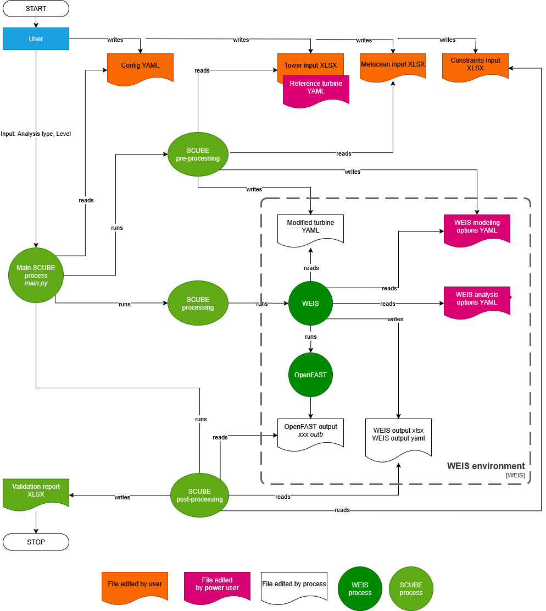

What is SCUBE?
==============
SCUBE is a Python package to support the preliminary design and analysis of towers for offshore wind turbines.

It has been developed by the University of Strathclyde for Scottish Power and SSE Renewables, during the TIC-LCPE project “Wind-19 Stiff-stiff tower for FOWT: development of a design and benchmarking tool”, between January and October 2025.

**Key Features:**

- It leverages the capabilities of the software `WEIS <https://weis.readthedocs.io/en/latest/>`_ by NREL
- Can be used to benchmark a given offshore wind turbine tower design, or to support its preliminary design
- Simple input spreadsheets for: tower characteristics, environmental characteristics, analysis and/or design criteria to be checked
- Simple output spreadsheets 

How does it work?
=================

Wrapper
-------
SCUBE is, essentially, a wrapper.

A wrapper is a script/package that serves as an intermediary for running other software, commands, or scripts, often adding additional setup, input adaptation, or error handling without modifying the underlying tool.
In this case, SCUBE is a wrapper of the `NREL software WEIS <https://weis.readthedocs.io/en/latest/index.html>`_.
Why a wrapper? maine advantages are:
- Simplification: Hides complex command-line options or repeated setup steps from users.
- Pre-/Post-processing: Performs tasks before or after the main program runs, such as logging, data preparation, or cleanup.
- Adaptation: Passes user input to underlying tools after converting it to an acceptable format, improving compatibility and usability.

SCUBE data flow diagram
-----------------------

